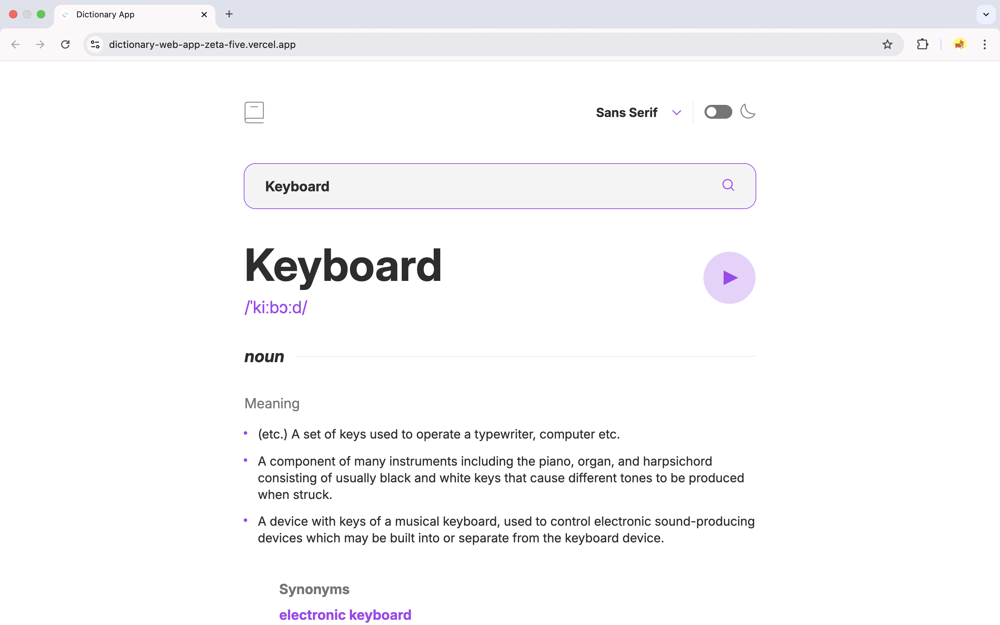
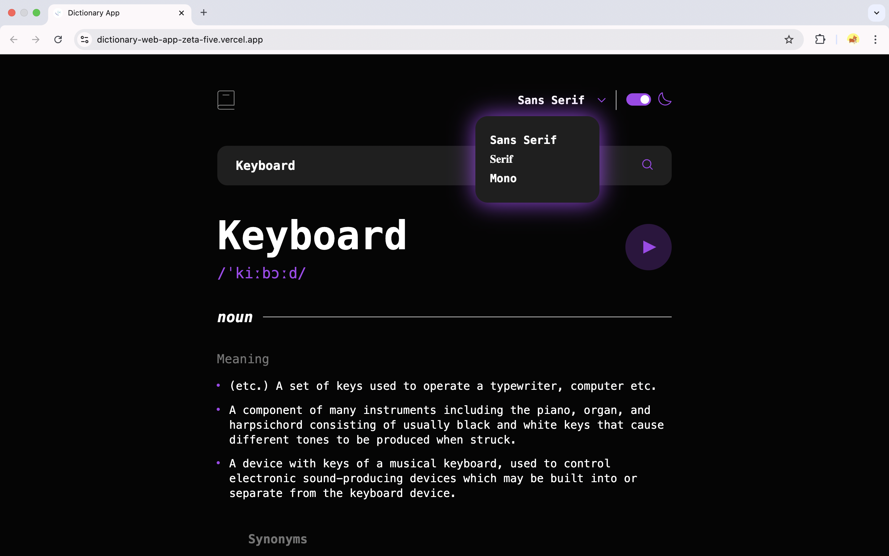

# 📖 Dictionary Web App

A sleek and simple **Dictionary Web App** built with **React** that lets you search for word meanings instantly using a public dictionary API. Explore definitions, phonetics, and examples — all in a clean, minimal UI.

🔗 **Live Demo:** [dictionary-web-app-zeta-five.vercel.app](https://dictionary-web-app-zeta-five.vercel.app/)

---

## Screenshots




## 🌟 Features
- 🔍 **Instant Search:** Type any word and get its definition right away  
- 🗣️ **Phonetics & Pronunciation:** Listen to how the word is pronounced  
- 💬 **Multiple Meanings:** View different parts of speech and examples  
- 🌓 **Light / Dark Theme:** Clean, modern UI that adapts to your preference  
- ⚡ **Responsive Design:** Works beautifully on desktop and mobile  

---

## 🛠️ Tech Stack
| Technology | Description |
|-------------|-------------|
| **React** | Frontend framework for building UI |
| **TypeScript** | For type safety and better code readability |
| **SCSS** | Modular and reusable styling |
| **Dictionary API** | Fetches word data and meanings |

---

## 🚀 Getting Started

Follow these steps to run the project locally:

```bash
# 1️⃣ Clone the repository
git clone https://github.com/<your-username>/dictionary-web-app.git

# 2️⃣ Navigate into the project
cd dictionary-web-app

# 3️⃣ Install dependencies
npm install

# 4️⃣ Run the development server
npm run dev
